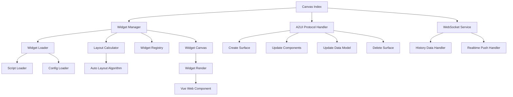
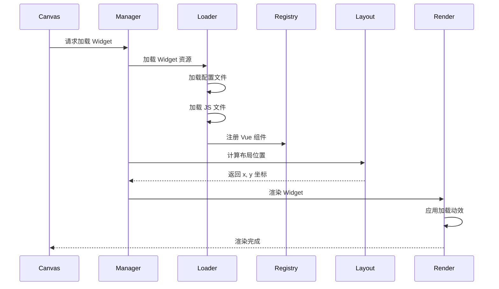
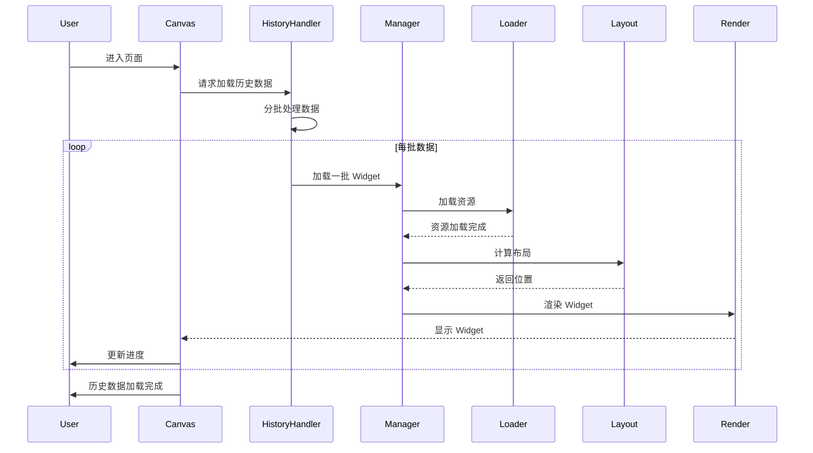
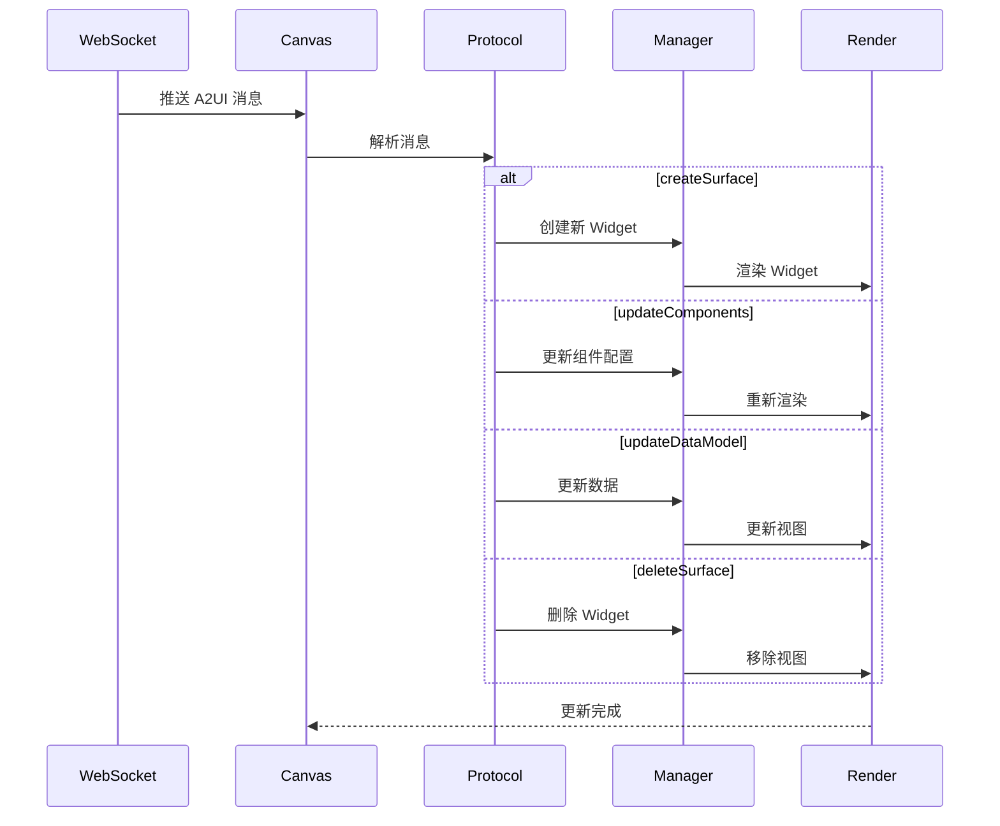

# A2UI 0.9 Widget 动态加载与渲染设计文档

## 📋 项目背景

对接其他团队提供的 vue-web-component，该组件会被打包成 JS 文件，通过动态加载 script 标签的方式引入，并注册为 Vue 组件。使用 A2UI 0.9 协议实现 Widget 在画布中的动态渲染。

---

## 🎯 核心需求

1. **动态加载 Widget JS 文件**：从远程加载 vue-web-component 的 JS 文件并注册为 Vue 组件
2. **A2UI 0.9 协议集成**：支持 createSurface、updateComponents、updateDataModel、deleteSurface 等操作
3. **历史数据渲染**：支持一次性渲染历史 Widget，后续通过 WebSocket 推送增量添加
4. **自动布局算法**：根据配置文件的 w、h 自动计算 x、y 位置（从左到右、从上到下）
5. **加载动效**：Widget 加载时添加平滑的过渡动画
6. **配置文件支持**：除了 JS 文件，还需要加载配置文件（包含 w、h 等信息）
7. **测试 Demo**：在 [`canvas/index.vue`](../src/views/aiCanvas/canvas/index.vue:1) 中提供完整的测试用例和数据
8. **代码可读性**：清晰的模块划分、完善的注释、统一的命名规范

---

## 🏗️ 系统架构设计

### 整体架构图



### 模块职责划分

#### 1. **Widget Manager** (核心管理器)
- **职责**：统一管理 Widget 的生命周期
- **功能**：
  - Widget 注册与注销
  - Widget 状态管理
  - 协调加载器、布局计算器、渲染器

#### 2. **Widget Loader** (加载器)
- **职责**：动态加载 Widget 资源
- **功能**：
  - 加载 Widget JS 文件
  - 加载 Widget 配置文件
  - 缓存已加载的资源
  - 错误处理与重试机制

#### 3. **Layout Calculator** (布局计算器)
- **职责**：自动计算 Widget 位置
- **功能**：
  - 根据 w、h 计算 x、y
  - 从左到右、从上到下的布局算法
  - 避免重叠检测
  - 动态调整布局

#### 4. **A2UI Protocol Handler** (协议处理器)
- **职责**：处理 A2UI 0.9 协议消息
- **功能**：
  - createSurface：创建 Widget 实例
  - updateComponents：更新 Widget 组件配置
  - updateDataModel：更新 Widget 数据
  - deleteSurface：删除 Widget 实例

#### 5. **History Data Handler** (历史数据处理器)
- **职责**：处理历史数据的批量渲染
- **功能**：
  - 批量加载历史 Widget
  - 优化渲染性能（分批渲染）
  - 加载进度反馈

---

## 📐 详细设计

### 1. Widget 加载流程



### 2. 文件结构设计

```
src/views/aiCanvas/canvas/
├── index.vue                          # 测试 Demo 和主入口
├── components/
│   ├── widgetCanvas.vue              # Widget 画布容器
│   ├── widgetRender.vue              # Widget 渲染器
│   └── toolbar.vue                   # 工具栏
├── core/
│   ├── WidgetManager.js              # Widget 管理器
│   ├── WidgetLoader.js               # Widget 加载器
│   ├── LayoutCalculator.js           # 布局计算器
│   ├── A2UIProtocolHandler.js        # A2UI 协议处理器
│   └── HistoryDataHandler.js         # 历史数据处理器
├── utils/
│   ├── scriptLoader.js               # Script 动态加载工具
│   ├── configLoader.js               # 配置文件加载工具
│   └── animationHelper.js            # 动画辅助工具
├── constants/
│   ├── a2uiConstants.js              # A2UI 协议常量
│   └── widgetConstants.js            # Widget 相关常量
└── mixins/
    └── widgetLifecycle.mixin.js      # Widget 生命周期 Mixin
```

### 3. 核心类设计

#### 3.1 WidgetManager (Widget 管理器)

```javascript
class WidgetManager {
  constructor() {
    this.widgets = new Map()           // 存储所有 Widget 实例
    this.loader = new WidgetLoader()   // Widget 加载器
    this.layout = new LayoutCalculator() // 布局计算器
    this.protocol = new A2UIProtocolHandler() // 协议处理器
  }

  /**
   * 加载单个 Widget
   * @param {Object} widgetConfig - Widget 配置
   * @returns {Promise<Object>} Widget 实例
   */
  async loadWidget(widgetConfig) {}

  /**
   * 批量加载 Widget（历史数据）
   * @param {Array} widgetConfigs - Widget 配置数组
   * @returns {Promise<Array>} Widget 实例数组
   */
  async loadWidgetsBatch(widgetConfigs) {}

  /**
   * 更新 Widget
   * @param {String} surfaceId - Surface ID
   * @param {Object} updateData - 更新数据
   */
  updateWidget(surfaceId, updateData) 

  /**
   * 删除 Widget
   * @param {String} surfaceId - Surface ID
   */
  removeWidget(surfaceId) {}

  /**
   * 获取所有 Widget
   * @returns {Array} Widget 列表
   */
  getAllWidgets() {}
}
```

#### 3.2 WidgetLoader (Widget 加载器)

```javascript
class WidgetLoader {
  constructor() {
    this.loadedScripts = new Set()     // 已加载的 JS 文件缓存
    this.loadedConfigs = new Map()     // 已加载的配置文件缓存
    this.loadingPromises = new Map()   // 正在加载的 Promise
  }

  /**
   * 加载 Widget JS 文件
   * @param {String} jsUrl - JS 文件 URL
   * @returns {Promise<void>}
   */
  async loadScript(jsUrl) {}

  /**
   * 加载 Widget 配置文件
   * @param {String} configUrl - 配置文件 URL
   * @returns {Promise<Object>} 配置对象
   */
  async loadConfig(configUrl) {}

  /**
   * 注册 Vue 组件
   * @param {String} componentName - 组件名称
   * @param {Object} component - 组件定义
   */
  registerComponent(componentName, component) {}

  /**
   * 检查组件是否已注册
   * @param {String} componentName - 组件名称
   * @returns {Boolean}
   */
  isComponentRegistered(componentName) {}
}
```

#### 3.3 LayoutCalculator (布局计算器)

```javascript
class LayoutCalculator {
  constructor(options = {}) {
    this.colNum = options.colNum || 12  // 列数
    this.margin = options.margin || 8   // 间距
    this.occupiedCells = []             // 已占用的单元格
  }

  /**
   * 计算下一个可用位置
   * @param {Number} w - 宽度
   * @param {Number} h - 高度
   * @returns {Object} {x, y} 坐标
   */
  calculateNextPosition(w, h) {}

  /**
   * 检查位置是否可用
   * @param {Number} x - X 坐标
   * @param {Number} y - Y 坐标
   * @param {Number} w - 宽度
   * @param {Number} h - 高度
   * @returns {Boolean}
   */
  isPositionAvailable(x, y, w, h) {}

  /**
   * 标记位置为已占用
   * @param {Number} x - X 坐标
   * @param {Number} y - Y 坐标
   * @param {Number} w - 宽度
   * @param {Number} h - 高度
   */
  markPositionOccupied(x, y, w, h) {}

  /**
   * 释放位置
   * @param {Number} x - X 坐标
   * @param {Number} y - Y 坐标
   * @param {Number} w - 宽度
   * @param {Number} h - 高度
   */
  releasePosition(x, y, w, h) {}

  /**
   * 重置布局
   */
  reset() {}
}
```

#### 3.4 A2UIProtocolHandler (A2UI 协议处理器)

```javascript
class A2UIProtocolHandler {
  constructor(widgetManager) {
    this.widgetManager = widgetManager
    this.catalogUrl = 'https://www.h3c.com/ai-canvas/spec/a2ui/0.9/catalog_definition.json'
  }

  /**
   * 处理 createSurface 消息
   * @param {Object} message - A2UI 消息
   */
  async handleCreateSurface(message) {}

  /**
   * 处理 updateComponents 消息
   * @param {Object} message - A2UI 消息
   */
  handleUpdateComponents(message) {}

  /**
   * 处理 updateDataModel 消息
   * @param {Object} message - A2UI 消息
   */
  handleUpdateDataModel(message) {}

  /**
   * 处理 deleteSurface 消息
   * @param {Object} message - A2UI 消息
   */
  handleDeleteSurface(message) {}

  /**
   * 验证消息格式
   * @param {Object} message - A2UI 消息
   * @returns {Boolean}
   */
  validateMessage(message) {}
}
```

#### 3.5 HistoryDataHandler (历史数据处理器)

```javascript
class HistoryDataHandler {
  constructor(widgetManager) {
    this.widgetManager = widgetManager
    this.batchSize = 5  // 每批渲染数量
  }

  /**
   * 加载历史数据
   * @param {Array} historyData - 历史数据数组
   * @param {Function} onProgress - 进度回调
   * @returns {Promise<void>}
   */
  async loadHistoryData(historyData, onProgress) {}

  /**
   * 分批渲染
   * @param {Array} data - 数据数组
   * @param {Number} batchSize - 批次大小
   * @returns {Promise<void>}
   */
  async renderInBatches(data, batchSize) {}
}
```

### 4. 布局算法详解

#### 4.1 从左到右、从上到下的布局算法

```javascript
/**
 * 布局算法实现
 * 1. 维护一个二维数组表示网格占用情况
 * 2. 从左到右、从上到下扫描可用位置
 * 3. 找到第一个能容纳当前 Widget 的位置
 */
calculateNextPosition(w, h) {
  // 从第 0 行开始扫描
  for (let y = 0; y < 1000; y++) {
    // 从第 0 列开始扫描
    for (let x = 0; x <= this.colNum - w; x++) {
      // 检查当前位置是否可用
      if (this.isPositionAvailable(x, y, w, h)) {
        // 标记为已占用
        this.markPositionOccupied(x, y, w, h)
        return { x, y }
      }
    }
  }
  
  // 如果没有找到合适位置，放在最后
  return { x: 0, y: this.getMaxY() + 1 }
}
```

### 5. 加载动效设计

#### 5.1 动画效果

- **淡入效果**：Widget 从透明到不透明
- **缩放效果**：Widget 从 0.8 倍缩放到 1 倍
- **位移效果**：Widget 从上方滑入
- **错开延迟**：多个 Widget 依次出现，每个延迟 100ms

#### 5.2 CSS 动画实现

```css
/* Widget 进入动画 */
@keyframes widget-enter {
  0% {
    opacity: 0;
    transform: translateY(-20px) scale(0.95);
  }
  100% {
    opacity: 1;
    transform: translateY(0) scale(1);
  }
}

.widget-enter-active {
  animation: widget-enter 0.4s cubic-bezier(0.4, 0, 0.2, 1);
}

/* 加载骨架屏 */
.widget-skeleton {
  background: linear-gradient(90deg, #f0f0f0 25%, #e0e0e0 50%, #f0f0f0 75%);
  background-size: 200% 100%;
  animation: skeleton-loading 1.5s infinite;
}

@keyframes skeleton-loading {
  0% {
    background-position: 200% 0;
  }
  100% {
    background-position: -200% 0;
  }
}
```

### 6. A2UI 0.9 协议消息格式

#### 6.1 createSurface (创建 Surface)

```javascript
{
  type: 'createSurface',
  surfaceId: 'widget-001',
  catalogId: 'https://www.h3c.com/ai-canvas/spec/a2ui/0.9/catalog_definition.json',
  widgetConfig: {
    jsUrl: 'https://cdn.example.com/widgets/line-chart.js',
    configUrl: 'https://cdn.example.com/widgets/line-chart-config.json',
    componentName: 'widget-line-chart'
  }
}
```

#### 6.2 updateComponents (更新组件)

```javascript
{
  type: 'updateComponents',
  surfaceId: 'widget-001',
  components: [
    {
      id: 'root',
      component: 'widget-line-chart',
      title: 'CPU 使用率',
      xAxisName: '时间',
      yAxisName: { path: '/perf/yAxisName' },
      data: { path: '/perf/data' }
    }
  ]
}
```

#### 6.3 updateDataModel (更新数据模型)

```javascript
{
  type: 'updateDataModel',
  surfaceId: 'widget-001',
  path: '/perf',
  op: 'replace',  // 操作类型: replace, add, remove
  value: {
    yAxisName: 'CPU使用率',
    data: [
      { xAxis: '2026-01-18 14:00:00', yAxis: 45.2 },
      { xAxis: '2026-01-18 14:01:00', yAxis: 52.8 }
    ]
  }
}
```

#### 6.4 deleteSurface (删除 Surface)

```javascript
{
  type: 'deleteSurface',
  surfaceId: 'widget-001'
}
```

### 7. Widget 配置文件格式

```json
{
  "widgetId": "widget-line-chart",
  "componentName": "widget-line-chart",
  "version": "1.0.0",
  "layout": {
    "w": 6,
    "h": 7,
    "minW": 4,
    "minH": 5,
    "maxW": 12,
    "maxH": 20
  },
  "resizable": true,
  "draggable": true,
  "title": "折线图",
  "description": "用于展示趋势数据的折线图组件",
  "props": {
    "title": {
      "type": "String",
      "default": ""
    },
    "data": {
      "type": "Array",
      "required": true
    }
  }
}
```

---

## 🔄 数据流设计

### 1. 历史数据加载流程



### 2. 实时推送流程



---

## 🎨 UI/UX 设计

### 1. 加载状态展示

- **骨架屏**：Widget 加载时显示骨架屏占位
- **进度条**：批量加载时显示整体进度
- **加载提示**：显示当前加载的 Widget 名称
- **错误提示**：加载失败时显示友好的错误信息

### 2. 交互反馈

- **Hover 效果**：鼠标悬停时 Widget 轻微上浮
- **拖拽反馈**：拖拽时显示半透明占位符
- **缩放反馈**：缩放时实时显示尺寸信息
- **删除确认**：删除 Widget 前弹出确认对话框

---

## 📊 性能优化策略

### 1. 资源加载优化

- **并发控制**：限制同时加载的 JS 文件数量（最多 3 个）
- **缓存机制**：已加载的 JS 文件和配置文件缓存到内存
- **预加载**：提前加载常用 Widget 的资源
- **懒加载**：Widget 进入可视区域时才渲染

### 2. 渲染优化

- **虚拟滚动**：大量 Widget 时使用虚拟滚动
- **分批渲染**：历史数据分批渲染，避免阻塞主线程
- **防抖节流**：窗口 resize 事件使用防抖
- **requestAnimationFrame**：动画使用 RAF 优化

### 3. 内存优化

- **组件销毁**：Widget 删除时清理事件监听和定时器
- **数据清理**：定期清理不再使用的缓存数据
- **弱引用**：使用 WeakMap 存储临时数据

---

## 🧪 测试用例设计

### 1. 单元测试

- WidgetLoader 加载测试
- LayoutCalculator 布局算法测试
- A2UIProtocolHandler 消息处理测试
- HistoryDataHandler 批量加载测试

### 2. 集成测试

- 完整的 Widget 加载流程测试
- WebSocket 推送消息处理测试
- 历史数据 + 实时推送混合测试

### 3. 测试数据 (在 index.vue 中)

```javascript
// 测试数据示例
const testData = {
  // 历史数据（模拟已存在的 Widget）
  historyWidgets: [
    {
      surfaceId: 'history-widget-1',
      widgetConfig: {
        jsUrl: '/mock/widgets/line-chart.js',
        configUrl: '/mock/widgets/line-chart-config.json',
        componentName: 'widget-line-chart'
      },
      data: {
        title: 'CPU 使用率',
        categories: ['00:00', '01:00', '02:00', '03:00'],
        series: [{ name: 'CPU', data: [45, 52, 48, 61] }]
      }
    },
    // ... 更多历史数据
  ],
  
  // 实时推送数据（模拟 WebSocket 推送）
  realtimeMessages: [
    {
      type: 'createSurface',
      surfaceId: 'realtime-widget-1',
      // ...
    },
    {
      type: 'updateDataModel',
      surfaceId: 'history-widget-1',
      // ...
    }
  ]
}
```

---

## 🚀 实施计划

### 阶段 1：基础架构搭建
- 创建核心类文件结构
- 实现 WidgetLoader 基础功能
- 实现 LayoutCalculator 布局算法

### 阶段 2：协议处理实现
- 实现 A2UIProtocolHandler
- 集成 WebSocket 服务
- 实现消息分发机制

### 阶段 3：UI 和动效
- 实现加载动画
- 实现骨架屏
- 优化交互体验

### 阶段 4：历史数据处理
- 实现 HistoryDataHandler
- 实现分批渲染
- 实现进度反馈

### 阶段 5：测试和优化
- 编写测试用例
- 性能优化
- 代码重构和文档完善

---

## 📝 代码规范

### 1. 命名规范

- **类名**：大驼峰 (PascalCase)，如 `WidgetManager`
- **方法名**：小驼峰 (camelCase)，如 `loadWidget`
- **常量**：全大写下划线 (UPPER_SNAKE_CASE)，如 `MAX_RETRY_COUNT`
- **私有属性**：下划线前缀，如 `_internalState`

### 2. 注释规范

- **类注释**：说明类的职责和用途
- **方法注释**：使用 JSDoc 格式，包含参数、返回值、示例
- **复杂逻辑**：添加行内注释说明算法思路

### 3. 错误处理

- **统一错误类**：定义 `WidgetError` 错误类
- **错误日志**：使用统一的日志工具记录错误
- **用户提示**：友好的错误提示信息

---

## 🔐 安全考虑

### 1. XSS 防护

- 动态加载的 JS 文件需要验证来源
- 配置文件内容需要进行 sanitize
- 避免使用 `eval` 和 `Function` 构造器

### 2. CORS 处理

- 配置正确的 CORS 策略
- 使用 HTTPS 加载远程资源

### 3. 资源验证

- 验证 JS 文件的完整性（可选：使用 SRI）
- 验证配置文件的 JSON 格式
- 限制加载的资源大小

---

## 📚 参考资料

- A2UI 0.9 协议规范：`https://www.h3c.com/ai-canvas/spec/a2ui/0.9/`
- Vue 动态组件：`https://vuejs.org/guide/essentials/component-basics.html#dynamic-components`
- vue-grid-layout 文档：`https://github.com/jbaysolutions/vue-grid-layout`

---

## ✅ 验收标准

1. ✅ 能够动态加载远程 Widget JS 文件并注册为 Vue 组件
2. ✅ 支持 A2UI 0.9 协议的所有消息类型
3. ✅ 历史数据能够正确渲染，且有进度反馈
4. ✅ 实时推送的 Widget 能够正确添加到画布
5. ✅ 布局算法能够正确计算位置，无重叠
6. ✅ 加载动画流畅自然
7. ✅ 代码结构清晰，注释完善
8. ✅ 测试用例覆盖核心功能
9. ✅ 性能满足要求（100 个 Widget 加载时间 < 5s）
10. ✅ 无内存泄漏

---

## 🎯 下一步行动

请审阅此设计文档，确认以下内容：

1. **架构设计**是否合理？
2. **模块划分**是否清晰？
3. **布局算法**是否满足需求？
4. **A2UI 协议处理**是否完整？
5. **性能优化策略**是否充分？
6. **测试方案**是否完善？

确认无误后，我们将进入编码实现阶段。
