# A2UI Widget 系统架构图

## 1. 系统整体架构

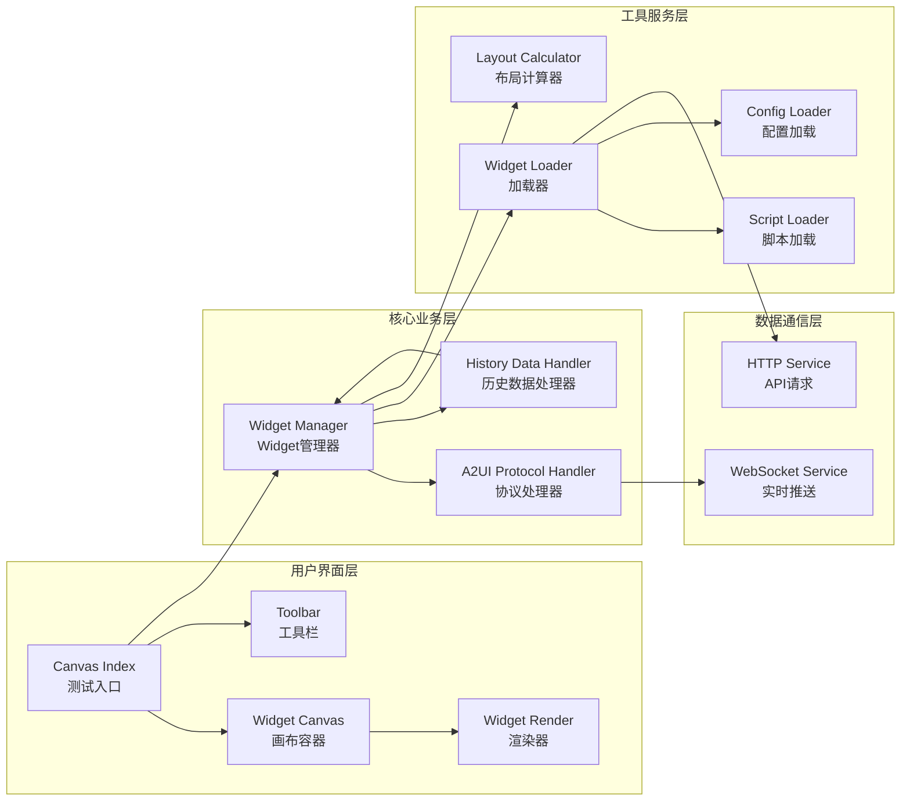

## 2. Widget 生命周期流程

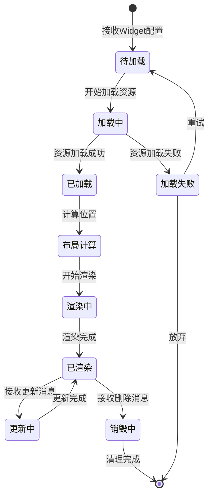

## 3. 历史数据加载时序图

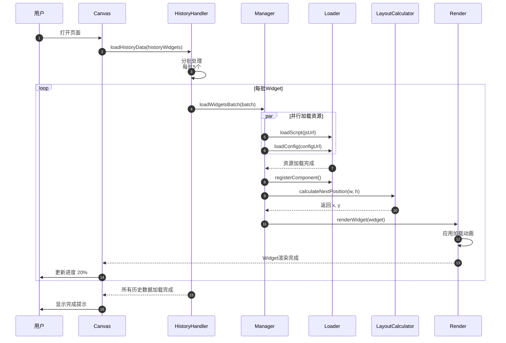

## 4. 实时推送处理流程

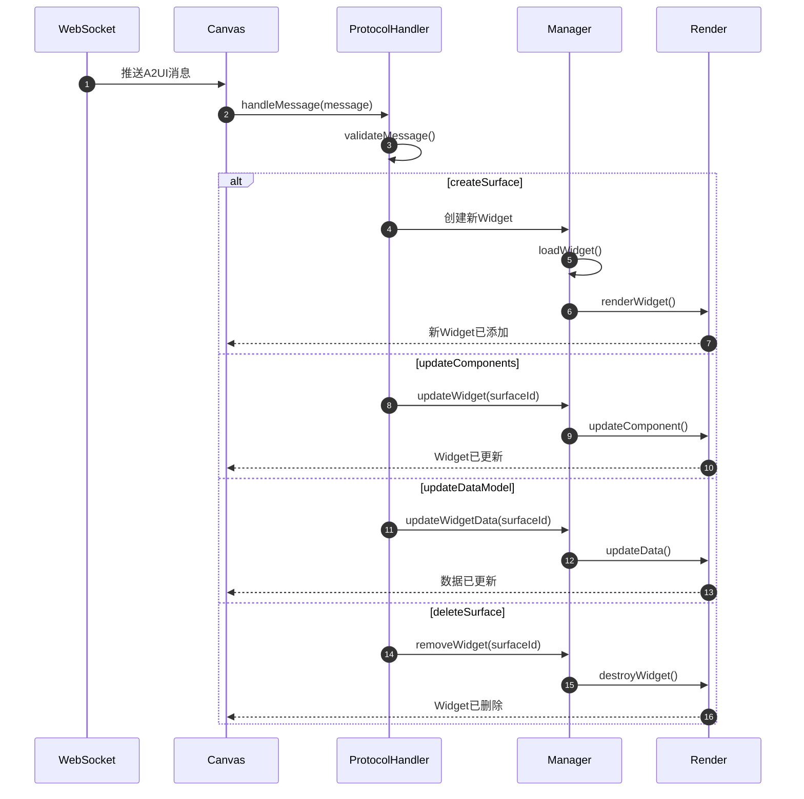

## 5. 布局算法可视化

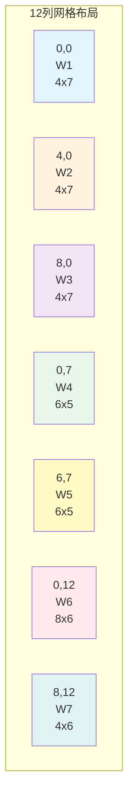

**布局规则说明：**
- 网格总列数：12 列
- 扫描顺序：从左到右、从上到下
- 位置计算：找到第一个能容纳当前 Widget 的空位
- 冲突检测：检查目标区域是否与已有 Widget 重叠

## 6. 数据流向图

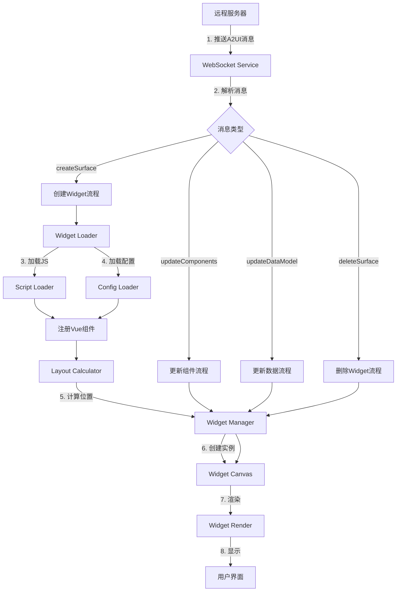

## 7. 模块依赖关系

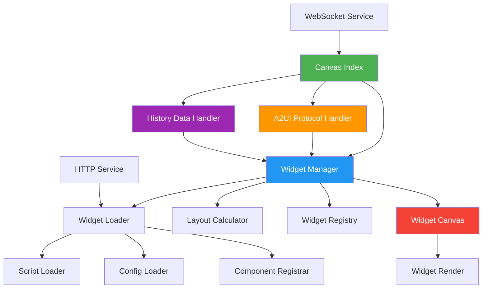

## 8. 错误处理流程

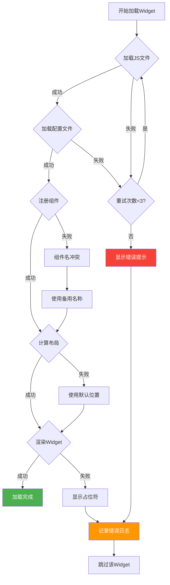

## 9. 性能优化策略图

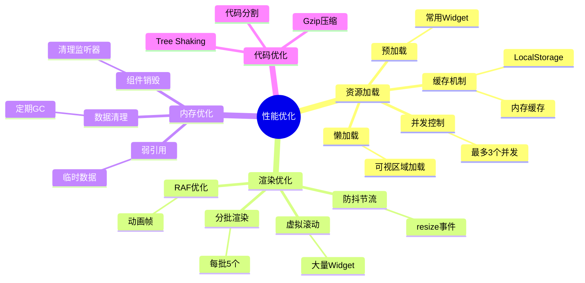

## 10. 安全防护机制

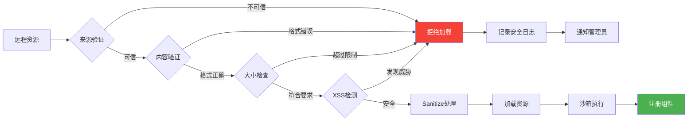

## 11. 测试覆盖范围

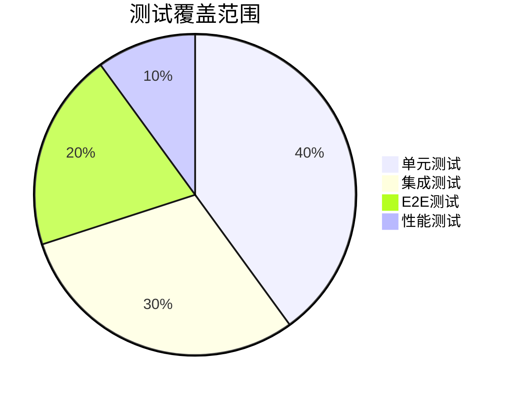

**测试详情：**

- **单元测试 (40%)**
  - Widget Loader 测试
  - Layout Calculator 测试
  - Protocol Handler 测试
  - 工具函数测试

- **集成测试 (30%)**
  - Widget 完整加载流程
  - A2UI 消息处理流程
  - 历史数据加载流程

- **E2E 测试 (20%)**
  - 用户操作流程
  - 多场景测试
  - 兼容性测试

- **性能测试 (10%)**
  - 加载性能测试
  - 渲染性能测试
  - 内存泄漏测试

## 12. 部署架构

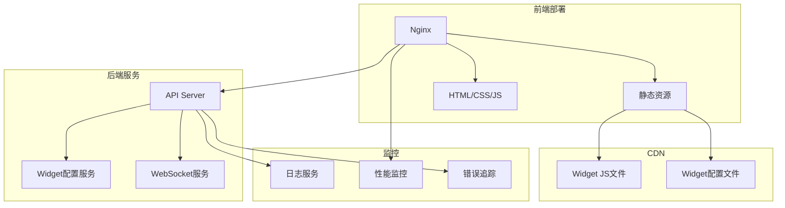

---

## 总结

以上架构图从多个维度展示了 A2UI Widget 系统的设计：

1. **整体架构**：展示了系统的分层结构
2. **生命周期**：描述了 Widget 从创建到销毁的完整流程
3. **时序图**：详细说明了各模块之间的交互顺序
4. **布局算法**：可视化展示了网格布局的计算方式
5. **数据流向**：清晰展示了数据在系统中的流转路径
6. **依赖关系**：说明了各模块之间的依赖关系
7. **错误处理**：完善的错误处理和降级策略
8. **性能优化**：多维度的性能优化方案
9. **安全防护**：全面的安全防护机制
10. **测试覆盖**：完整的测试策略
11. **部署架构**：生产环境的部署方案

这些图表配合主设计文档，能够帮助团队更好地理解系统设计，为后续的开发实施提供清晰的指导。
